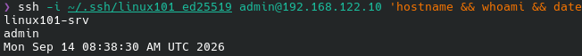
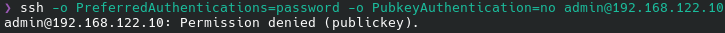
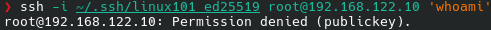

# Modul 1: VM-opsætning og netværk

*Se [`00-tilgang.md`](00-tilgang.md) for den overordnede begrundelse for valg af NixOS og den
tekniske arkitektur (bootstrap / iteration / sikkerhedsnet), som dette modul bygger direkte på.*

## Formål

At etablere et rent, kontrolleret og reproducerbart udgangspunkt for serveren, samt sikre den
første og mest kritiske indgang til systemet: fjernadgang.

## Sikkerhedsmæssig relevans

Den første adgangsvej ind i en server (her: SSH) er samtidig den mest udsatte. Fejl i denne fase
— f.eks. adgangskodebaseret root-login — undergraver alle senere hærdningstiltag. Ligeledes er et
reproducerbart udgangspunkt en forudsætning for, at resten af opgavens dokumentation ("hvorfor er
denne konfiguration sikker") overhovedet er meningsfuld: hvis VM'en ikke er identisk hver gang den
oprettes, kan sikkerhedsvurderingen ikke genskabes eller kontrolleres af andre.

## Tilgang: bootstrap af VM'en

VM'en oprettes ikke ved en manuel, interaktiv installation, men ved:

1. En `flake.nix` definerer VM'ens fulde `nixosConfiguration` (netværk, brugere, SSH, firewall osv.
   for modul 1-5 samlet).
2. `nixos-generators` bygger et qcow2-diskimage direkte fra denne flake.
3. `virt-install --import` opretter VM'en i libvirt fra dette image.

**Fordel frem for en traditionel Debian/Ubuntu-installation:** Opgaven beder om at installere en
server-distribution "uden GUI i en VM" — typisk en manuel, interaktiv proces (netinst-wizard,
partitionering, valg af pakker). Med NixOS er hele denne proces i stedet én kommandosekvens, der kan
køres igen og igen med samme konfiguration, pakkesæt og opsætning som resultat. Det er et konkret,
demonstrerbart bevis for "reproducerbart udgangspunkt", som en manuel installation ikke kan give uden
ekstra værktøj (fx Packer/Ansible oven på Debian).

*Præcisering:* "Reproducerbar" betyder her, at `flake.lock` fastlåser den præcise version af
nixpkgs og alle pakker, så to genopbygninger fra samme flake giver samme software, samme
konfiguration og samme sikkerhedsopsætning. Det er ikke det samme som at hver fil i disk-imaget er
byte-for-byte identisk mellem to uafhængige builds — fx genererer `mkfs.ext4` et nyt, tilfældigt
filsystem-UUID for hver build. Den relevante sikkerhedsgaranti er den første (konfigurationen kan
ikke drifte), ikke den sidste.

**Ulempe/omkostning:** Bootstrap-processen kræver, at vi selv har sat Nix, `nixos-generators` og
libvirt-værktøjerne op korrekt på værten først — der er altså mere forudgående værktøjsopsætning end
ved at boote en officiel installations-ISO. Denne omkostning er betalt én gang og kommer alle
efterfølgende moduler til gode.

## Forudsætninger på værten (udført)

Før selve VM'en kan bygges, skal værten (CachyOS) have de nødvendige virtualiserings- og
byggeværktøjer på plads. Dette er ikke i sig selv en del af serverens sikkerhedskonfiguration,
men er medtaget her for gennemsigtighed og reproducerbarhed — en anden, der skal genskabe
opsætningen, skal kunne se hele kæden.

- Installerede værtspakker: `qemu-full`, `libvirt`, `virt-manager`, `dnsmasq`, `edk2-ovmf`.
- Brugeren tilføjet til grupperne `kvm` og `libvirt`, så VM'er kan administreres uden konstant
  brug af root/sudo — samme need-to-know/least-privilege-princip som resten af opgaven bygger på
  (uddybes i modul 3).
- `libvirtd.service` aktiveret og startet (`systemctl enable --now`).
- Libvirts default NAT-netværk aktiveret med autostart:
  - Bro: `virbr0`
  - Subnet: `192.168.122.0/24`
  - Gateway/DNS for gæster: `192.168.122.1`
  - DHCP-interval: `192.168.122.2`–`192.168.122.254` (VM'ens statiske IP vælges bevidst uden for
    den travle del af dette interval for at undgå kollision, se nedenfor).
- Nix-pakkehåndteringen installeret separat på værten (Determinate Systems-installeren), da
  `nixos-generators` kræver den til at bygge VM'ens diskimage.

## Opgaver og hvordan de løses under NixOS

| Opgave (fra opgavebeskrivelsen) | Traditionel løsning | NixOS-løsning |
|---|---|---|
| Installer Linux server-distro uden GUI | Boot en Debian/Ubuntu-installations-ISO og gennemgå en interaktiv netinst-wizard (partitionering, pakkevalg, lokalisering) | `nix build .#qcow` bygger et qcow2-diskimage direkte fra `flake.nix` (ingen interaktion), hvorefter `virt-install --import` opretter VM'en i libvirt fra det færdige image — se den fulde kommandosekvens i "Dokumentation/output" nedenfor |
| Statisk IP og sigende hostname | Redigér `/etc/network/interfaces` eller netplan manuelt på den installerede server | `networking.hostName = "linux101-srv";` og `networking.interfaces.eth0.ipv4.addresses = [{ address = "192.168.122.10"; prefixLength = 24; }];` deklareret i `nixos/modules/network.nix` |
| Ikke-root administratorbruger | `useradd -m -G sudo admin && passwd admin` | `users.users.admin = { isNormalUser = true; openssh.authorizedKeys.keys = [ ... ]; };` deklareret i `nixos/modules/users.nix` — rollen udbygges med granulær sudo i modul 3 |
| Deaktiver direkte root-login via SSH | Redigér `/etc/ssh/sshd_config`: sæt `PermitRootLogin no` og genstart `sshd` manuelt | `services.openssh.settings.PermitRootLogin = "no";` i `nixos/modules/network.nix` — genereres direkte ind i `sshd_config` ved hver `nixos-rebuild switch` |
| SSH kun nøglebaseret, password-login deaktiveret | Redigér `/etc/ssh/sshd_config`: sæt `PasswordAuthentication no`, og læg den offentlige nøgle i brugerens `~/.ssh/authorized_keys` manuelt | `services.openssh.settings.PasswordAuthentication = false;` i `nixos/modules/network.nix`, kombineret med `users.users.admin.openssh.authorizedKeys.keys = [ "ssh-ed25519 ..." ];` i `nixos/modules/users.nix` — begge dele af samme versionsstyrede konfiguration, ikke to separate manuelle trin |

## Sikkerhedsbegrundelse for hvert valg (opgave 5)

Opgaven beder eksplicit om, at hvert valg dokumenteres med 1-2 sætningers sikkerhedsmæssig
begrundelse:

- **Server-distribution uden GUI:** Et grafisk miljø tilføjer pakker, tjenester og angrebsflade,
  som en server, der udelukkende driftes via SSH, aldrig har brug for. Færre installerede
  komponenter betyder færre potentielle sårbarheder.
- **Statisk IP:** En DHCP-tildelt adresse kan ændre sig ved lease-fornyelse, hvilket ville bryde
  firewallens kilde-IP-begrænsning (modul 4) og gøre det sværere entydigt at identificere serveren
  i logs og alarmer over tid.
- **Sigende hostname** (`linux101-srv`): Gør det muligt entydigt at identificere serveren i logs,
  alarmer og revisionsspor — vigtigt i incident response, hvor man hurtigt skal kunne se, præcis
  hvilken maskine en hændelse stammer fra.
- **Ikke-root administratorbruger:** At arbejde som en navngivet, individuel bruger frem for
  direkte som root er en forudsætning for sporbarhed (handlinger kan spores til én konkret konto)
  og for at kunne tilbagekalde adgang for én person uden at påvirke andre. Det er samtidig
  grundlaget for granulær sudo i modul 3, i stedet for permanent, ubegrænset root-adgang.
- **Deaktiveret direkte root-login via SSH:** Root er den mest værdifulde konto at kompromittere.
  Ved at kræve login som en almindelig bruger først — og kun derefter eksplicit, afgrænset sudo —
  tilføjes et ekstra lag, og automatiserede angreb rettet specifikt mod kontoen "root" bliver
  virkningsløse.
- **Kun nøglebaseret SSH, password-login deaktiveret:** Adgangskoder kan gættes, genbruges på
  tværs af tjenester eller lække ved databrud andetsteds; en privat SSH-nøgle kan ikke gættes og
  findes kun ét sted.

**Sikkerhedsargument for den deklarative SSH-hærdning:** På et traditionelt system er
`sshd_config` en fil, der kan redigeres ad hoc af enhver med root-adgang, uden at ændringen
nødvendigvis bliver dokumenteret eller versionsstyret — konfigurationen kan drifte væk fra det
oprindeligt godkendte setup uden at nogen opdager det. På NixOS er `sshd_config` en genereret fil:
den eneste måde at ændre SSH-opsætningen varigt på er via `configuration.nix`, som er versionsstyret.
En evt. "midlertidig" svækkelse (fx en tekniker der slår `PasswordAuthentication` til for at fejlsøge)
forsvinder automatisk ved næste `nixos-rebuild switch`, medmindre den er eksplicit committet.

## Dokumentation/output

### Bootstrap-kommandosekvens (udført)

```
nix build .#qcow -L                                            # bygger qcow2 fra flake.nix
sudo virsh pool-define-as default dir --target /var/lib/libvirt/images
sudo virsh pool-autostart default
sudo virsh pool-start default
sudo virsh vol-create-as default linux101-srv.qcow2 5196742656 --format qcow2
sudo virsh vol-upload --pool default linux101-srv.qcow2 result/nixos.qcow2
sudo virt-install --name linux101-srv --memory 3072 --vcpus 2 \
    --disk vol=default/linux101-srv.qcow2,bus=virtio \
    --network network=default,model=virtio \
    --graphics none --console pty,target_type=serial \
    --import --os-variant generic --noautoconsole
```

`flake.lock` pinner `nixpkgs` til commit `eaad089` og `nixos-generators` til commit `8946737`.
Så længe `flake.lock` ikke ændres, giver ovenstående sekvens et bit-for-bit identisk resultat —
det er selve beviset for reproducerbarhedsargumentet fra [`00-tilgang.md`](00-tilgang.md).

### Fejlfinding undervejs

Ovenstående sekvens er den *endelige, virkende* opskrift — men at nå dertil krævede reel
fejlfinding, som er værd at dokumentere, fordi den viser nogle konkrete NixOS-mekanismer:

1. **Version-mismatch mellem nixpkgs og nixos-generators.** Første forsøg brugte
   `nixpkgs.url = "github:NixOS/nixpkgs/nixos-24.05"`. `nixos-generators`' `qcow`-format
   (commit `8946737`) refererer til et nixpkgs-modul (`disk-size-option.nix`), som endnu ikke
   fandtes i `nixos-24.05`-grenen. Fejlen viste sig først ved selve `nix build .#qcow`, ikke ved
   flake-evaluering. Løsning: `nixpkgs.url` ændret til `nixos-unstable` — stadig fuldstændig
   fastlåst via `flake.lock`, så reproducerbarhedsargumentet er uberørt.
2. **`nixosConfigurations.linux101-srv` manglede en disk/bootloader-profil.** `nixos-generators`
   tilføjer automatisk `fileSystems."/"` og `boot.loader.grub.device` m.m., men kun til selve
   image-bygningen (`packages.x86_64-linux.qcow`) — ikke til den almindelige
   `nixosConfigurations`, som `nixos-rebuild switch --target-host` bruger. Uden dette fejlede
   evalueringen med *"The 'fileSystems' option does not specify your root file system."* Løsning:
   `nixos/hardware-vm.nix`, som replikerer de nødvendige værdier (fundet ved at læse
   `nixos-generators`' eget `formats/qcow.nix` i dets kildekode) og kun importeres i
   `nixosConfigurations` — ikke i den delte `configuration.nix` — for at undgå dobbeltdefinition
   med image-byggerens egen kopi af de samme indstillinger.

Disse to rettelser blev lavet *efter* at VM'en allerede kørte (under arbejdet med modul 2), hvilket
afslørede et tredje problem: `admin` har ingen adgangskode (kun SSH-nøgle), så `sudo` på den
*allerede kørende* VM kunne ikke bruges til at aktivere den rettede konfiguration — hverken via
`nixos-rebuild --target-host` (manglede `trusted-users`, se [`00-tilgang.md`](00-tilgang.md)) eller
via lokal `sudo`. I stedet for en workaround (fx midlertidigt genåbne root-login) brugte vi selve
reproducerbarheds-egenskaben til at løse problemet: VM'en og dens diskimage blev slettet og
genskabt fra bunden med den fuldt rettede `flake.nix`. Det er et konkret eksempel på, at
"slet og genskab fra flake" ikke kun er et teoretisk argument, men en arbejdsmetode vi selv kom til
at bruge i praksis.

### Verifikation: vellykket SSH-login med nøgle

```
$ ssh -i ~/.ssh/linux101_ed25519 admin@192.168.122.10 'hostname && whoami'
linux101-srv
admin
```



### Verifikation: afvist password-login

```
$ ssh -v -o PreferredAuthentications=password -o PubkeyAuthentication=no admin@192.168.122.10 'echo test'
debug1: Authentications that can continue: publickey
admin@192.168.122.10: Permission denied (publickey).
```



Serveren tilbyder udelukkende `publickey` som godkendt autentifikationsmetode — password er ikke
engang til stede i den forhandlede metodeliste, hvilket bekræfter at `PasswordAuthentication = false`
og `KbdInteractiveAuthentication = false` er trådt i kraft.

### Verifikation: afvist root-login (selv med gyldig nøgle)

```
$ ssh -i ~/.ssh/linux101_ed25519 root@192.168.122.10 'echo test'
root@192.168.122.10: Permission denied (publickey).
```



Root afvises, uanset at samme SSH-nøgle bruges, fordi `PermitRootLogin = "no"`. Derudover har
root ingen gyldig password-hash (`users.users.root.hashedPassword = "!"`), hvilket lukker
adgangsvejen helt af — også via evt. lokal/konsol-login, ikke kun via SSH.

### Relevante konfigurationsuddrag

`nixos/modules/network.nix` — statisk IP, hostname, SSH-hærdning (se filen for fuld kontekst):

```nix
networking.hostName = "linux101-srv";
networking.usePredictableInterfaceNames = false;
networking.interfaces.eth0.ipv4.addresses = [{ address = "192.168.122.10"; prefixLength = 24; }];
networking.defaultGateway = "192.168.122.1";

services.openssh.settings = {
  PermitRootLogin = "no";
  PasswordAuthentication = false;
  KbdInteractiveAuthentication = false;
};
```

`nixos/modules/users.nix` — ikke-root administratorbruger:

```nix
users.mutableUsers = false;
users.users.admin = {
  isNormalUser = true;
  extraGroups = [ "wheel" ];
  openssh.authorizedKeys.keys = [ "ssh-ed25519 AAAA...42bMc admin@linux101-srv" ];
};
users.users.root.hashedPassword = "!";
```

*(Bemærk: `extraGroups = [ "wheel" ]` er en midlertidig, bred sudo-adgang. Denne strammes i
modul 3 til granulære `security.sudo.extraRules`, som er NixOS-svaret på opgavens
`/etc/sudoers.d/`-krav.)*
